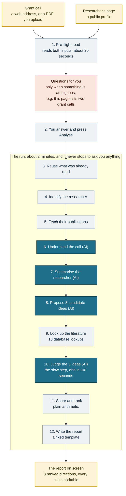

# How this tool works, from your input to the report on screen

This document explains what happens between the moment you press **Analyse** and the moment
a report appears. It assumes you know nothing about the project. There is no code in it.

---

## 1. What the tool is for

A researcher wants to apply for a research grant. Two questions come first:

- *What could I propose that this particular funder would actually want to fund?*
- *Is there really a gap there, or has the field already done it?*

Answering that properly means reading the funding call, reading the researcher's own track
record, and then reading the recent literature. That is a day of work, and it is the same
day of work every time.

This tool does that pass in about two minutes and hands back **three research directions**,
ranked, each one written against the actual call and the actual person — and every factual
claim in it linked to a document or database record the tool genuinely fetched.

---

## 2. What you give it

Two things:

| Input | What it is | Example |
|---|---|---|
| **The grant call** | The web address of a funding call, or a PDF of one you upload | `https://www.rgp.gov.sg/nrf-ar/crp` |
| **The researcher's page** | A public page about the researcher — a lab page, a university staff page, a personal academic site | `https://basurafernando.github.io/` |

That is all. No login, no CV upload, no list of keywords.

---

## 3. The one rule that everything else follows

This is worth understanding before the steps, because it explains why the tool is built the
way it is.

> **The program collects the facts. The AI is never allowed to write one.**

Every fact the tool retrieves — a page of a PDF, a search result, a paper, a citation count
— is filed as a numbered slip of paper: `e1`, `e2`, `e3`, and so on. Each slip records where
the fact came from, and that record is written by the program from the actual response it
received, never by the AI.

The AI's job is only to **read the slips and reason about them**. When it wants to support a
sentence, it may only point at slip numbers. Two separate mechanisms keep it there:

- The AI's answer form has **no box for a web address**, a source title or a link. A developer
  who tried to add one would find the program refuses to start.
- Anything the AI writes in ordinary prose is **scanned for web addresses before it is stored**,
  and any it finds are removed and reported. This matters because the AI is shown real page
  text, which sometimes contains links — so it could copy one across without meaning to.

And if the AI points at a slip number that does not exist, the claim is dropped and a warning
is shown.

The practical consequence: **the tool cannot invent a citation.** If you see a link in the
report, something actually fetched it. This is the single most important property of the
tool, because a confident-sounding fake reference is worse than no answer at all.

---

## 4. The journey, step by step

Here is the whole flow. Steps 1–2 happen before the run; steps 3–12 are the run itself.

The four dark boxes marked **(AI)** are the only steps a language model touches. Everything
else is ordinary, predictable program logic that does the same thing every time.

---

### Step 1 — The pre-flight read

**What happens:** before anything expensive starts, the tool fetches and reads both of your
inputs so it can find out whether your request is ambiguous.

Grant call pages are often not one call. The Singapore example above lists **two** separate
calls with different deadlines, and names **three** funding schemes. If the tool just guessed,
the whole report would quietly be about the wrong one.

**Tools used in this step:**

| Tool | What it is for |
|---|---|
| `ingest_grant` | Fetches the grant call and gets the readable text out of it. It tries three ways in order: read the page normally; if the page hides its text (some modern sites do), recover it from the page's own data; and finally follow links to attached documents — PDFs, and ZIP files which it opens and looks inside. On the Singapore call this finds seven PDFs, including the 21-page call information sheet where the real detail lives. |
| `ingest_profile` | Fetches the researcher's page and gets the readable text and the researcher's name out of it. |

The tool works out what each thing *is* by asking the server what it sent, not by looking at
the file name — so a PDF served from a URL ending in `/download` is still read as a PDF.

**What you get back:** a short list of questions, each with the options it actually found in
the documents. For the Singapore call:

- *"This page lists 2 grant calls. Which one are you applying to?"* → **CRP36** / **2026 Frontier CRP** / *Not sure*
- *"The call names 3 funding schemes. Which one is yours?"* → **T-CRP** / **CRP36** / **F-CRP** / *All of them*

This takes about 20 seconds. No AI is involved — the questions come from patterns found in
the real text, and each option can be traced back to the page it was found on.

> **Why ask at all?** Because the alternative is a confident report about the wrong grant. The
> tool asks *before* it starts, never in the middle — so once a run is going, it runs to
> completion without waiting on you.

---

### Step 2 — You answer, and the run starts

You pick your answers and press **Analyse**. The tool immediately gives the run an address of
its own (a page like `/runs/run-004-…`), so you can refresh, close the tab, or send the link
to a colleague and still be watching the same run.

---

### Step 3 — Reuse what was already read

**Tool:** `reuse_probe_documents` — carries the documents from the pre-flight read into the
run.

**Purpose:** the pre-flight already downloaded seven PDFs and a profile page. Doing it again
would waste around 17 seconds and file every fact twice. This step hands the existing slips
straight over — 56 of them on the Singapore example.

---

### Step 4 — Work out who the researcher actually is

**Tool:** `resolve_author` — looks the researcher up in **OpenAlex**, a free, open database of
around 250 million published works.

**Purpose:** to connect a name on a web page to a real publication record.

This is harder than it sounds, because names are not unique. The tool ranks the candidates
using how many works they have, how well their research topics overlap with the profile page,
and whether their institution matches the profile's web domain. Importantly, institution is
used to **rank**, never to **rule out** — a researcher who has just moved job would otherwise
vanish.

The result is always labelled **"unverified"** on screen, with an invitation to correct it.
The tool matched a name; it did not prove an identity, and it says so.

---

### Step 5 — Fetch what they have published

**Tool:** `fetch_author_works` — retrieves that author's most-cited publications (up to 40).

**Purpose:** this is the evidence for what the researcher can actually do. It is used in step 7,
and it is why the report can say "this fits you" rather than "this is a nice idea".

---

### Step 6 — Understand what the call is asking for  🤖

**Tool:** `llm_grant_brief` — the **first** of four AI calls.

**Purpose:** to turn 20-odd pages of funding call into a structured brief — the objectives,
who is eligible, what the evaluation criteria are, when it closes.

The AI reads the retrieved text and points at slip numbers. When it quotes the call, the
program then goes back and checks that the quote appears **word for word** in the source. If
it does not, you get a warning on screen naming the criterion and showing the quote that
failed. (On the sample run, two quotes failed this check — both were lightly reworded lists
of criteria. You see them; nothing is hidden.)

---

### Step 7 — Summarise what the researcher is good at  🤖

**Tool:** `llm_capabilities` — the **second** AI call.

**Purpose:** to turn the profile page plus the publication list into a picture of methods,
topics and track record.

---

### Step 8 — Propose three candidate directions  🤖

**Tool:** `llm_candidates` — the **third** AI call.

**Purpose:** to propose three research directions that pair this call with this researcher,
and — just as importantly — to write **three search queries for each one**, nine in total.

**This step deliberately has not seen any literature yet.** It gets the grant brief and the
researcher's capabilities, and nothing else. So it is not allowed to say anything about what
the field has or has not done — any such claim would be invention. It proposes; it does not
assert. The gaps come later, in step 10, once there is something real to compare against.

---

### Step 9 — Go and look up the literature

This is the retrieval-heavy part, and it runs **for each of the three directions**. Six
lookups per direction, eighteen in total.

| Tool | Runs | What it is for |
|---|---|---|
| `search_literature` | 3× per direction | Runs one of the AI's search queries against OpenAlex, restricted to work published from 2022 onwards. It records **how many works exist** and which ones came back. Three different phrasings, so one badly worded query does not sink a good direction. It files a search-result slip — never a paper slip, because a search hit is not a paper you have read. |
| `fetch_top_works` | 1× per direction | Takes the most-cited works those searches found and retrieves each one's full record, **including its abstract** — four per direction, twelve in total. Only these become paper slips. A record that comes back without an abstract is skipped rather than counted, because filing it would claim a reading that never happened. |
| `topic_trend` | 1× per direction | Counts publications per year on that topic since 2019. This is what lets the report say a field is growing or flat, and show the curve behind it. |
| `citing_count` | 1× per direction | Takes the single most-cited paper found and counts how many papers published since 2023 cite it. This is a measure of whether the area is currently live. |

By the end of this step the tool holds roughly 85 slips: the grant document pages, the profile
page, about 17 search and measurement results, and 12 papers whose abstracts it retrieved.

---

### Step 10 — Judge the three directions  🤖

**Tool:** `llm_assessment` — the **fourth and last** AI call, and the only one that uses the
slower, more capable model. On the sample run it took about 99 seconds of the roughly two
minutes the whole run needs.

**Purpose:** now — and only now — the AI is shown the literature catalogue and asked to do the
real work:

- state the **problem** each direction addresses
- state the **evidence-backed gap**: what the retrieved literature does *not* cover
- list strengths and weaknesses
- score each direction against **seven criteria** from 0 to 10: grant alignment, scientific
  novelty, importance, applicant fit, feasibility, impact potential, and evidence strength

Every score must come with a short reason **and** at least one slip number. A score is never
allowed to be a bare number.

Each score is judged against a written rubric so the numbers mean the same thing from run to
run. For example, evidence strength scores 8 when "several papers' abstracts were retrieved,
and a trend and a citing count both point the same way", and 2 when "the claim rests on one
retrieved record, or on a query that returned almost nothing".

Two further criteria — competitive differentiation and collaboration potential — are **not
scored** in this build and are shown as *"not assessed"* rather than quietly given a zero.

---

### Step 11 — Score and rank

**No tool, no AI.** This is plain arithmetic: the overall score is the weighted average of the
criteria that were actually scored, rounded to two decimal places.

Two things follow from doing it this way:

- The number is **reproducible**. Anyone can check it.
- Because it is just arithmetic, **your browser can redo it instantly** — which is what makes
  the weight sliders in the report work without contacting the server at all.

The **confidence** label on each direction is also worked out here rather than asked of the AI.
It is read directly off the evidence-strength score, using that rubric's own thresholds.

> This means confidence is a statement about **how well-supported** a direction is, not about
> how good it is. A modest direction sitting on a large, well-measured literature can honestly
> be *high confidence*, while an exciting one resting on seventeen papers is *low confidence*.
> The report says which score it came from when you hover over the label.

---

### Step 12 — Write the report

**No tool, no AI.** The report is filled into a fixed template. Links can only appear where a
slip exists to justify them; a slip number with no slip behind it is printed as plain text
rather than as a broken link.

---

## 5. What you see while it runs

You do not stare at a spinner. The run streams its progress live, and the page shows:

- **an activity timeline** — every stage as it starts and finishes, every tool call with how
  long it took and how many new slips it produced, and which AI model was used
- **a running count** of sources gathered
- **warnings**, in yellow, as they happen — an unreachable page, a quote that didn't match,
  a direction with thin evidence

The sample run produced 160 timeline entries in about two minutes.

If you refresh the page, or open the link tomorrow, you get **the whole history from the
beginning** — the timeline is replayed from the start, not resumed from wherever you happen to
have rejoined.

---

## 6. What you get at the end

**Three ranked directions.** Each one shows:

- a title and its overall score out of 10, with a confidence label
- **the problem** it addresses, with evidence chips underneath
- **the evidence-backed gap** — what the retrieved literature does not cover — with chips
- three strengths and three weaknesses
- all nine criteria with their scores, the reason for each, and the evidence behind each

**A score matrix** — all three directions against all nine criteria at a glance.

**Weight sliders.** If you care more about novelty than feasibility, drag the sliders. The
cards re-rank instantly, with no network request, because the arithmetic is repeated in your
browser. The weights go into the page address, so "look at it with novelty turned up" is a
link you can paste to someone.

**Evidence you can open.** Every chip is clickable. Clicking one opens the slip: what it is,
where it came from, and a link to the actual source — the exact page of the exact PDF, or the
OpenAlex record for the paper.

**A downloadable report** in Markdown, from the run's own address, containing the same content
and the same links.

---

## 7. When something goes wrong

The tool is built so that one failure costs you a section, not the whole run:

| If this happens | What the tool does |
|---|---|
| A page or PDF cannot be reached | Records a warning, carries on with what it did get |
| A quote cannot be verified word-for-word | Shows you the warning with the quote in it |
| The AI points at a slip that does not exist | Drops the claim and warns |
| The AI writes a web address into its prose | Removes it and warns |
| A direction ends up below two pieces of evidence | Marks it *thin evidence* and caps its confidence at low |
| An AI call returns something unusable | Tries once more, then records a warning and continues |
| Any single stage fails outright | Warns, and the run continues to the report |

A run that hits problems produces a smaller, honest report. It does not produce a complete-
looking report with invented content in the gaps.

---

## 8. How long it takes

| Phase | Typical |
|---|---|
| Pre-flight read (fetching the call and profile) | ~20 seconds |
| The run itself | ~2 minutes |
| — of which the final AI judgement | ~1 minute 40 |

The budget the tool is built against is six minutes; real runs have come in between 112 and
158 seconds.

---

## 9. Summary — every tool in one table

| # | Step | Tool | AI? | Purpose |
|---|---|---|---|---|
| 1 | Pre-flight | `ingest_grant` | no | Fetch the call; recover text from the page, its hidden data, or attached PDFs and ZIPs |
| 1 | Pre-flight | `ingest_profile` | no | Fetch the researcher's page and pull out their name |
| 3 | Ingest | `reuse_probe_documents` | no | Carry the pre-flight's documents into the run instead of re-fetching |
| 4 | Identity | `resolve_author` | no | Match the name to a real OpenAlex author record, by ranking not filtering |
| 5 | Author works | `fetch_author_works` | no | Retrieve that author's most-cited publications |
| 6 | Grant brief | `llm_grant_brief` | **yes** | Turn the call into objectives, eligibility, criteria and dates |
| 7 | Capabilities | `llm_capabilities` | **yes** | Turn the profile and publications into methods, topics, track record |
| 8 | Candidates | `llm_candidates` | **yes** | Propose 3 directions and 9 search queries — with no literature in view |
| 9 | Literature | `search_literature` ×9 | no | Run each query; record how large the field is |
| 9 | Literature | `fetch_top_works` ×3 | no | Retrieve the top papers' records and abstracts — 12 papers |
| 9 | Literature | `topic_trend` ×3 | no | Publications per year since 2019, to show growth or flatness |
| 9 | Literature | `citing_count` ×3 | no | How many recent papers cite the top paper, to show whether it is live |
| 10 | Assessment | `llm_assessment` | **yes** | Write the gaps and score all directions against the rubric |
| 11 | Ranking | — | no | Weighted average; confidence read off evidence strength |
| 12 | Report | — | no | Fill the template; links only where a slip exists |

**Four AI calls. Every other step is the program doing exactly the same thing every time.**

---

## 10. What the tool does *not* do

Worth knowing before you trust a score:

- **It does not read papers.** It retrieves each paper's record and its **abstract**, and
  stores the first 400 characters of that abstract. It never opens the PDF or the full text.
- **It does not verify the researcher's identity.** It matches a name against a public
  database and labels the result *unverified*.
- **It does not check who else is working on this**, or who you might collaborate with —
  those two criteria are shown as *not assessed* rather than guessed at.
- **It does not predict funding success.** The score is a weighted average of judgements, not
  a forecast.
- **It does not write your proposal.**
